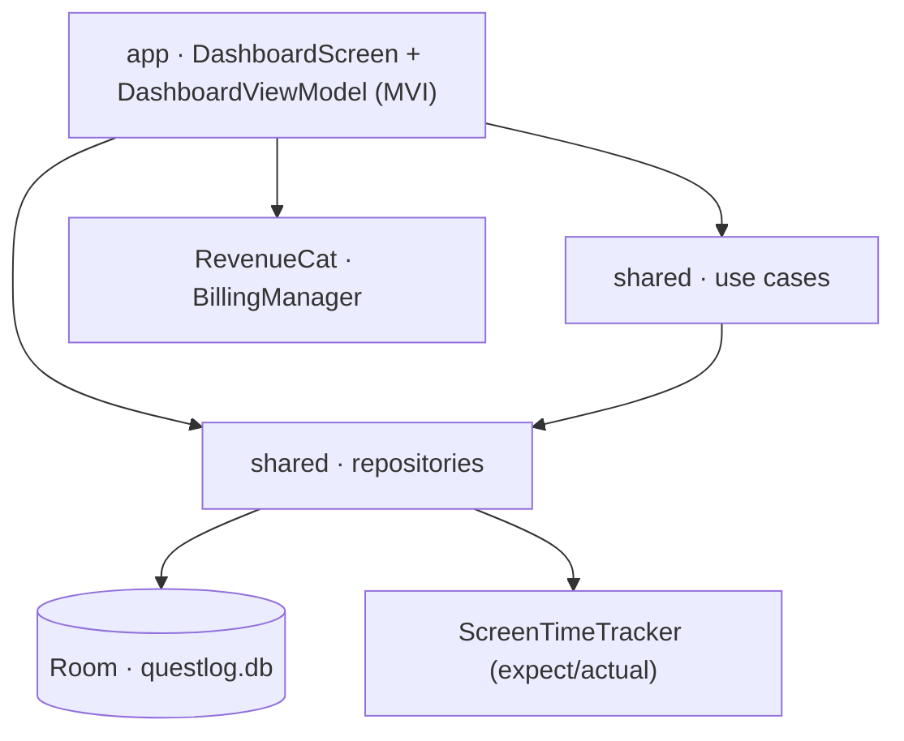
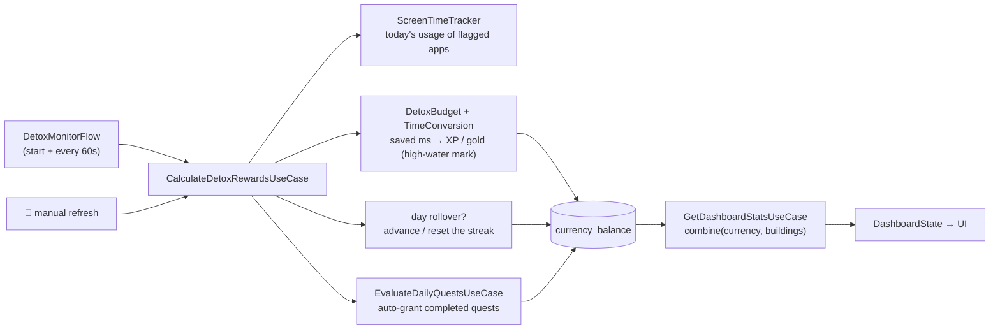

# QuestLog

A gamified digital‑detox Android app. You earn RPG rewards — XP, gold, levels, day
streaks — for **not** using distracting apps, and spend the gold building a fantasy
city. A RevenueCat "Pro" subscription unlocks premium buildings and perks.

- **Kotlin Multiplatform** core (`shared`) + **Jetpack Compose** Android UI (`app`)
- Kotlin 2.3.21 · AGP 9.0.1 · JDK 21 · `compileSdk 36` · `minSdk 26`
- Room 2.8.4 (KMP) · Koin · RevenueCat · Compose Material 3

---

## Module layout

```
QuestLog
├── shared/                 Kotlin Multiplatform — all domain + data logic
│   ├── commonMain          platform-agnostic: models, use cases, repositories, Room + migrations
│   ├── androidMain         UsageStatsManager tracker, Room builder, Koin platform module
│   └── desktopMain         no-op tracker (JVM target — exists so tests run without an emulator)
└── app/                    Android application — Compose UI only
    └── com.example.questlog  MainActivity, DashboardScreen + ViewModel, BillingManager
```

The `jvm("desktop")` target in `shared` carries no product code. It exists purely so
`commonTest` — and a real in‑memory Room database — can run on the JVM in seconds
instead of on an emulator.

## Architecture

Clean-ish layering inside `shared`, consumed by a single MVI screen in `app`.



| Layer | Pieces |
|---|---|
| `domain/model` | `PlayerStats`, `DetoxMetrics`, `CityTile`, `AppUsage`, `DailyQuest` |
| `domain/quest` | `QuestCatalog` — the 3 fixed quest definitions + their thresholds |
| `domain/platform` | `expect class ScreenTimeTracker` — Android: `UsageStatsManager` event API; desktop: returns empty |
| `domain/usecase` | `CalculateDetoxRewardsUseCase`, `EvaluateDailyQuestsUseCase`, `DetoxMonitorFlow`, `GetDashboardStatsUseCase`, `PurchaseBuildingUseCase` |
| `data/repository` | `ScreenTimeRepository`, `CurrencyRepository`, `InventoryRepository`, `DailyQuestRepository` |
| `data/local` | `QuestLogDatabase` (`@ConstructedBy`, bundled SQLite driver) + 4 entities / DAOs, `QuestLogMigrations`, `ItemTypeConverter` |
| `util` | `TimeConversion` (reward / level math), `DetoxBudget` (saved-time formula) — pure, fully unit-tested |
| `di` | `sharedModule` + `platformModule` (Koin) |

## The core loop



1. `DetoxMonitorFlow` emits on start and every 60 s (a failing tick is skipped, not fatal).
   The 🔄 button triggers the same recalculation on demand.
2. **Saved time.** `DetoxBudget` computes the day's saved time as
   `min(90 min, elapsed today) − total flagged-app foreground`, floored at 0 — the part of
   the day's 90‑minute budget you didn't spend on distractions. It accrues as clean time
   passes and each minute on a flagged app burns a minute of it.
3. **Rewards.** `TimeConversion` converts saved time to **10 XP + 2 gold per minute**,
   scaled by the **streak multiplier** `1.0 + 0.10 × consecutiveDays` (capped `3.0×`).
   Levels follow a triangular curve: `xpForLevel(n) = 100 · (n−1) · n / 2`. The grant is
   **idempotent per day** — a high-water mark (`awardedSavedMsToday` / `rewardDate`) means
   only the *increase* is ever granted, so repeated polls can't inflate the balance.
4. **Streak.** On the first run of a new calendar day, every day since the last run whose
   flagged-app foreground stayed within a 60‑minute budget adds to `consecutiveDetoxDays`;
   the first day over budget resets it. Phone-free gap days count as within budget.
5. **Quests.** `EvaluateDailyQuestsUseCase` checks the 3 fixed quests against the
   freshly-persisted data and auto-grants each reward exactly once per day (see below).
6. Everything lands in `currency_balance`, and the UI updates reactively through
   `GetDashboardStatsUseCase` (`combine(currency, buildings)`) plus the ViewModel's own
   `DailyQuestRepository.observeToday()` flow.

## Daily quests

Three fixed quests, evaluated on every detox tick, auto-granted once per day, reset at
midnight (completions are keyed by date). Definitions live in `domain/quest/QuestCatalog`.

| Quest | Completes when | Reward |
|---|---|---|
| Digital Fasting | Instagram foreground ≤ 15 min today | 150 XP / 30 gold |
| Deep Focus Shield | zero flagged-app foreground between 9am–12pm local (only decidable after noon) | 300 XP / 80 gold |
| Sanctuary Builder | any building constructed today | 200 XP / 50 gold |

## Persistence

One SQLite database, `questlog.db` (schema **v6**, migrations `1→…→6` in
`data/local/QuestLogMigrations.kt`, wired by `DatabaseFactory` in `androidMain`).

| Table | Key | Holds |
|---|---|---|
| `currency_balance` | `id = 1` (single row) | `xp`, `gold`, `gems`, `consecutiveDetoxDays`, `rewardDate`, `awardedSavedMsToday` |
| `screen_time_records` | `(packageName, date)` | `foregroundMs` — one row per app per day |
| `inventory_items` | `itemId` | `type`, `tier`, `isPremium`, `acquiredAt` |
| `quest_completions` | `(date, questId)` | `completedAt` — a row means the quest was completed and rewarded that day |

Exported schemas live in `shared/schemas/` and are used for migration diffing and by the
`MigrationTestHelper` tests.

## Build & test

Requires **JDK 21** and an Android SDK. Create `local.properties` with your SDK path:

```properties
sdk.dir=/path/to/Android/sdk
```

| Task | Command |
|---|---|
| Fast KMP tests (JVM) | `./gradlew :shared:desktopTest` |
| Android unit tests | `./gradlew :app:testDebugUnitTest` |
| Debug APK | `./gradlew :app:assembleDebug` |
| Release bundle | `./gradlew :app:bundleRelease` |

`.github/workflows/ci.yml` runs the two test suites plus `assembleDebug` on every push
and PR. `deploy-internal.yml` builds an AAB and ships it to the Play internal track on
push to `main` (gated on the `ANDROID_KEYSTORE_BASE64`,
`GOOGLE_PLAY_SERVICE_ACCOUNT_JSON`, and `REVENUECAT_API_KEY` secrets; no `signingConfigs`
are wired into Gradle yet).

### Testing approach (~58 tests)

- **Pure logic** (`TimeConversion`, `DetoxBudget`) — exhaustively unit-tested.
- **Use cases / repositories** — hand-written fake DAOs that model real Room semantics
  (e.g. an `UPDATE … WHERE id = 1` is a no-op when the row is absent).
  `EvaluateDailyQuestsUseCase` takes an injectable `Clock` so the 9am–12pm window quest
  can be tested deterministically.
- **Real Room, on the desktop target** — `ScreenTimeDaoTest` exercises Room's own SQL
  (conflict handling, composite keys) in an in-memory database, and
  `ScreenTimeMigrationTest` runs every migration through `MigrationTestHelper`, validating
  the result against the exported schema JSON — all as plain JVM tests, no emulator.

## Configuration

- **Distraction apps**: `defaultFlaggedPackages` in `di/SharedModule.kt` (Instagram,
  TikTok, Snapchat, X, Reddit, YouTube, Facebook).
- **Budgets / thresholds** are constructor params with defaults: the 90‑minute saved-time
  budget (`ScreenTimeRepository`), the 60‑minute streak budget
  (`CalculateDetoxRewardsUseCase`), and the quest constants in `QuestCatalog`.
- **Pro perks** (active while `BillingManager.isPremium`): a 2× multiplier on detox-time
  XP + gold (stacks with the streak multiplier), and a Streak Freeze Shield that protects
  one over-budget day per 7 days (`StreakFreeze.COOLDOWN_DAYS`).
- **Usage access**: the app needs the `PACKAGE_USAGE_STATS` special permission,
  granted by the user in *Settings → Apps → Special app access → Usage access*.
- **RevenueCat**: `BuildConfig.REVENUECAT_API_KEY` is a placeholder — inject a real
  key via `local.properties` or a CI secret before shipping.
