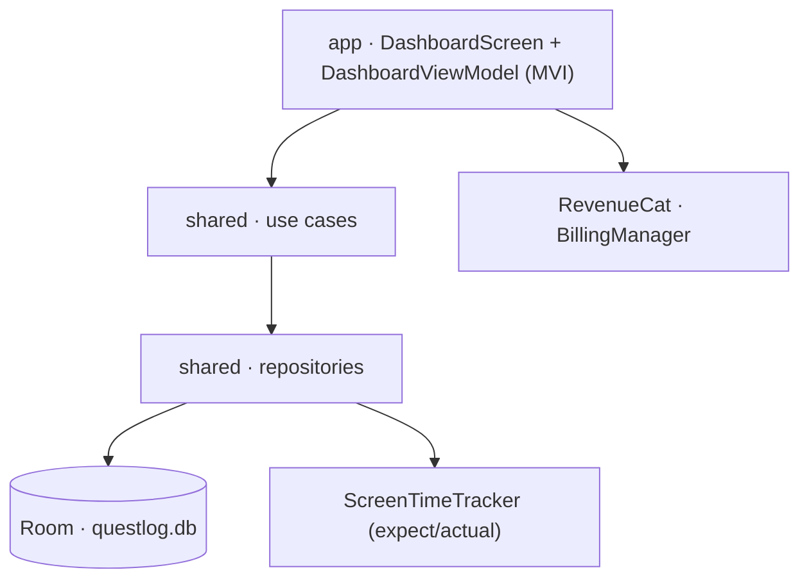
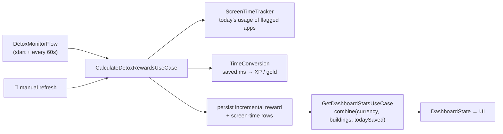

# QuestLog

A gamified digital‑detox Android app. You earn RPG rewards — XP, gold, levels, day
streaks — for **not** using distracting apps, and spend the gold building a fantasy
city. A RevenueCat "Pro" subscription unlocks premium buildings and perks.

- **Kotlin Multiplatform** core (`shared`) + **Jetpack Compose** Android UI (`app`)
- Kotlin 2.3.21 · AGP 9.0.1 · JDK 21 · `compileSdk 36` · `minSdk 26`
- Room 2.8.4 (KMP) · Koin · RevenueCat · Compose Material 3

---

## Module layout

```
QuestLog
├── shared/                 Kotlin Multiplatform — all domain + data logic
│   ├── commonMain          platform-agnostic: models, use cases, repositories, Room
│   ├── androidMain         UsageStatsManager tracker, Room builder + migrations, Koin
│   └── desktopMain          no-op tracker (JVM target — exists so tests run without an emulator)
└── app/                    Android application — Compose UI only
    └── com.example.questlog  MainActivity, DashboardScreen, ViewModel, BillingManager
```

The `jvm("desktop")` target in `shared` carries no product code. It exists purely so
`commonTest` — and a real in‑memory Room database — can run on the JVM in seconds
instead of on an emulator.

## Architecture

Clean-ish layering inside `shared`, consumed by a single MVI screen in `app`.



| Layer | Pieces |
|---|---|
| `domain/model` | `PlayerStats`, `DetoxMetrics`, `CityTile`, `AppUsage` |
| `domain/platform` | `expect class ScreenTimeTracker` — Android: `UsageStatsManager` event API; desktop: returns empty |
| `domain/usecase` | `CalculateDetoxRewardsUseCase`, `DetoxMonitorFlow`, `GetDashboardStatsUseCase`, `PurchaseBuildingUseCase` |
| `data/repository` | `ScreenTimeRepository`, `CurrencyRepository`, `InventoryRepository` |
| `data/local` | `QuestLogDatabase` (`@ConstructedBy`, bundled SQLite driver) + 3 entities / DAOs, `ItemTypeConverter` |
| `util` | `TimeConversion` — pure, fully unit-tested reward math |
| `di` | `sharedModule` + `platformModule` (Koin) |

## The core loop



1. `DetoxMonitorFlow` emits on start and every 60 s (a failing tick is skipped, not fatal).
   The 🔄 button triggers the same recalculation on demand.
2. `CalculateDetoxRewardsUseCase` reads today's foreground time for the flagged
   distraction packages and derives the day's "saved" time via `DetoxBudget`:
   `min(90 min, elapsed today) − total flagged foreground`, floored at 0 — the
   part of the day's 90-minute budget you didn't spend on distractions. It then
   converts that with `TimeConversion`:
   - **10 XP + 2 gold per saved minute**
   - **streak multiplier** `1.0 + 0.10 × consecutiveDays`, capped at `3.0×`
   - levels follow a triangular curve: `xpForLevel(n) = 100 · (n−1) · n / 2`
3. The reward is **idempotent per day** — it tracks a high-water mark
   (`awardedSavedMsToday` / `rewardDate`) and only ever grants the *increase*, so
   repeated polls or refreshes can't inflate the balance.
4. Writes flow back to the UI reactively through `GetDashboardStatsUseCase`, which
   `combine`s the currency balance (which carries today's saved-time high-water
   mark) with the owned buildings.

## Persistence

One SQLite database, `questlog.db` (schema **v6**, migrations in
`data/local/QuestLogMigrations.kt`).

| Table | Key | Holds |
|---|---|---|
| `currency_balance` | `id = 1` (single row) | `xp`, `gold`, `gems`, `consecutiveDetoxDays`, `rewardDate`, `awardedSavedMsToday` |
| `screen_time_records` | `(packageName, date)` | `foregroundMs` — one row per app per day |
| `inventory_items` | `itemId` | `type`, `tier`, `isPremium`, `acquiredAt` |
| `quest_completions` | `(date, questId)` | `completedAt` — a row means the quest was completed and rewarded that day |

Exported schemas live in `shared/schemas/` and are used for migration diffing.

## Build & test

Requires **JDK 21** and an Android SDK. Create `local.properties` with your SDK path:

```properties
sdk.dir=/path/to/Android/sdk
```

| Task | Command |
|---|---|
| Fast KMP tests (JVM) | `./gradlew :shared:desktopTest` |
| Android unit tests | `./gradlew :app:testDebugUnitTest` |
| Debug APK | `./gradlew :app:assembleDebug` |
| Release bundle | `./gradlew :app:bundleRelease` |

`.github/workflows/ci.yml` runs the two test suites plus `assembleDebug` on every push
and PR. `deploy-internal.yml` builds a signed AAB and ships it to the Play internal
track on push to `main` (gated on the `ANDROID_KEYSTORE_BASE64`,
`GOOGLE_PLAY_SERVICE_ACCOUNT_JSON`, and `REVENUECAT_API_KEY` secrets).

### Testing approach

- `TimeConversion` — pure functions, exhaustively unit-tested.
- Use cases / repositories — tested against hand-written fake DAOs.
- `ScreenTimeDaoTest` runs against a **real in-memory Room database** on the desktop
  target, so Room's own SQL (conflict handling, primary keys) is actually exercised.

## Configuration

- **Distraction apps**: `defaultFlaggedPackages` in `di/SharedModule.kt` (Instagram,
  TikTok, Snapchat, X, Reddit, YouTube, Facebook).
- **Usage access**: the app needs the `PACKAGE_USAGE_STATS` special permission,
  granted by the user in *Settings → Apps → Special app access → Usage access*.
- **RevenueCat**: `BuildConfig.REVENUECAT_API_KEY` is a placeholder — inject a real
  key via `local.properties` or a CI secret before shipping.
